
 
  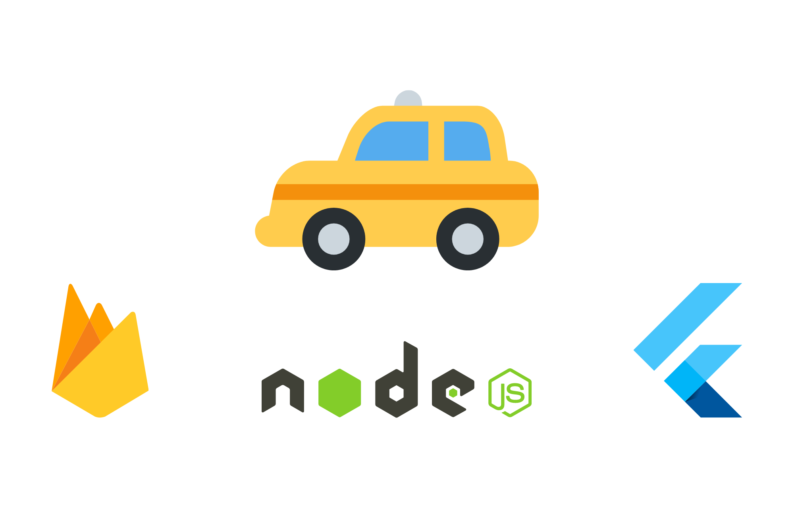

  &#xa0;

  <!-- <a href="https://taxi_readme.netlify.app">Demo</a> -->

<h1 align="center">Taxi Readme</h1>

  

  

  <!--  -->

  <!--  -->

  <!--  -->

<!-- Status -->

<!-- <h4 align="center"> 
	🚧  Taxi_Readme 🚀 Under construction...  🚧
</h4> 

 -->

  <a href="#dart-about">About</a> &#xa0; | &#xa0; 
  <a href="#camera-screenshots">Screenshots</a> &#xa0; | &#xa0; 
  <a href="#sparkles-features">Features</a> &#xa0; | &#xa0;
  <a href="#rocket-technologies">Technologies</a> &#xa0; | &#xa0;
  <a href="#memo-license">License</a> &#xa0; | &#xa0;
  <a href="https://github.com/GonzaloAldana" target="_blank">Author</a>

 

## :dart: About ##

This is a freelance project that I'm developing, there are 4 repos with the driver's app, rider's app, web admin and backed, all made with flutter, node and Firebase.

I won't show the source code but I'll give you a shot on the app. 

## :camera: Screenshots ##
 

  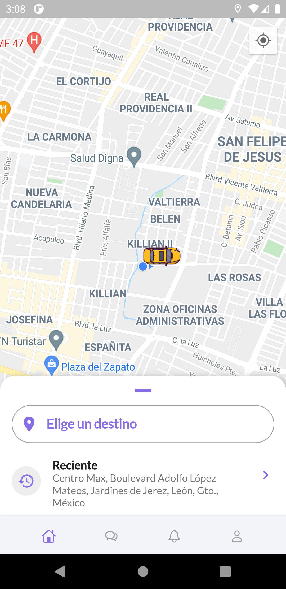
  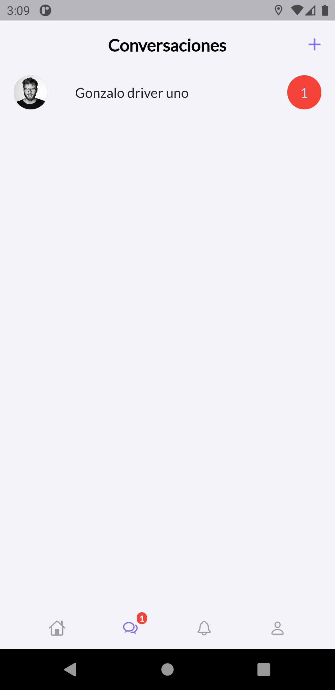
  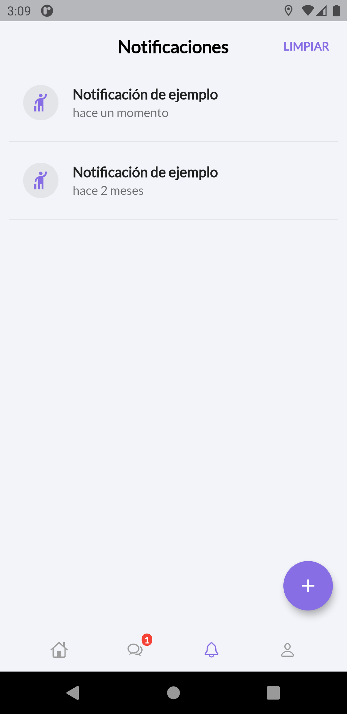
  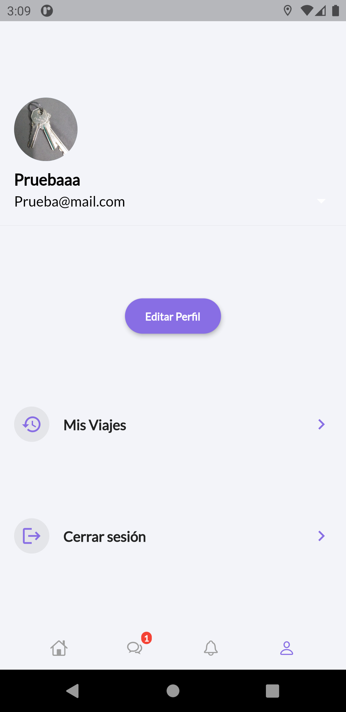
  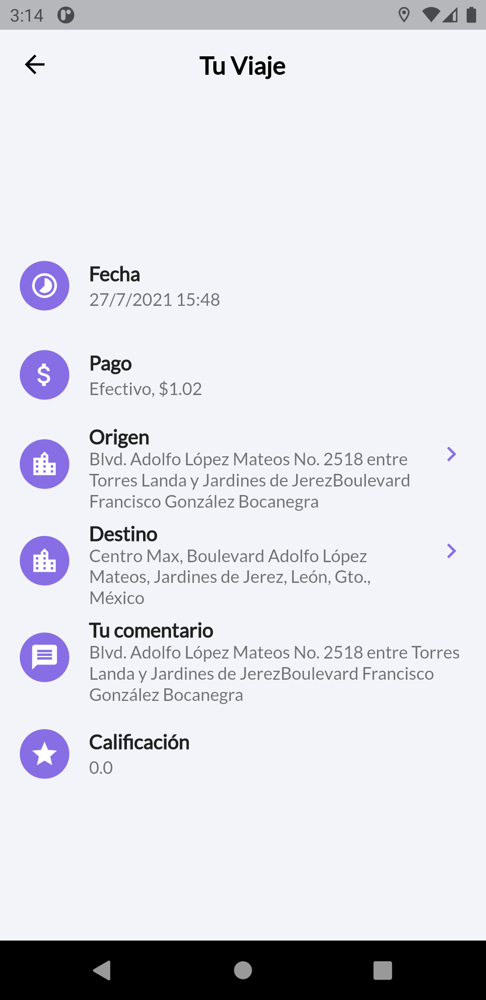
  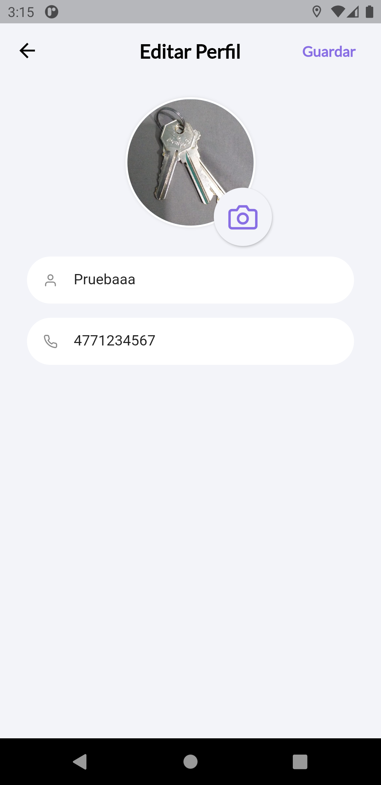
  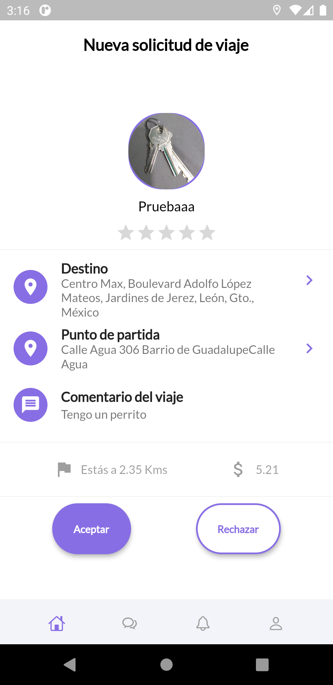
  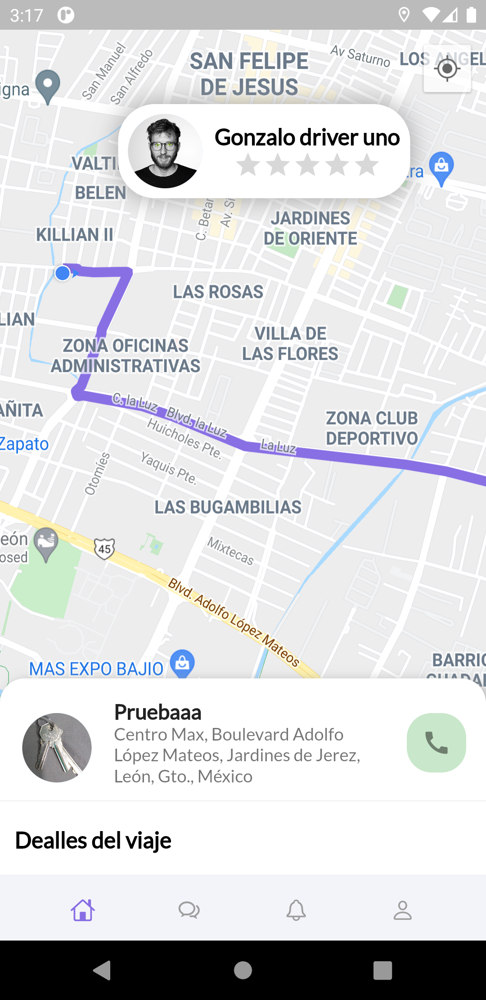
  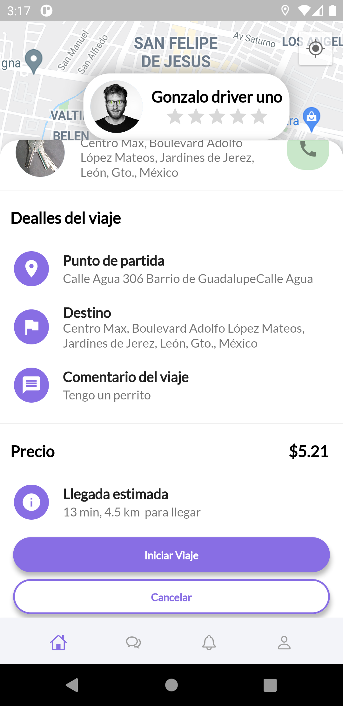
  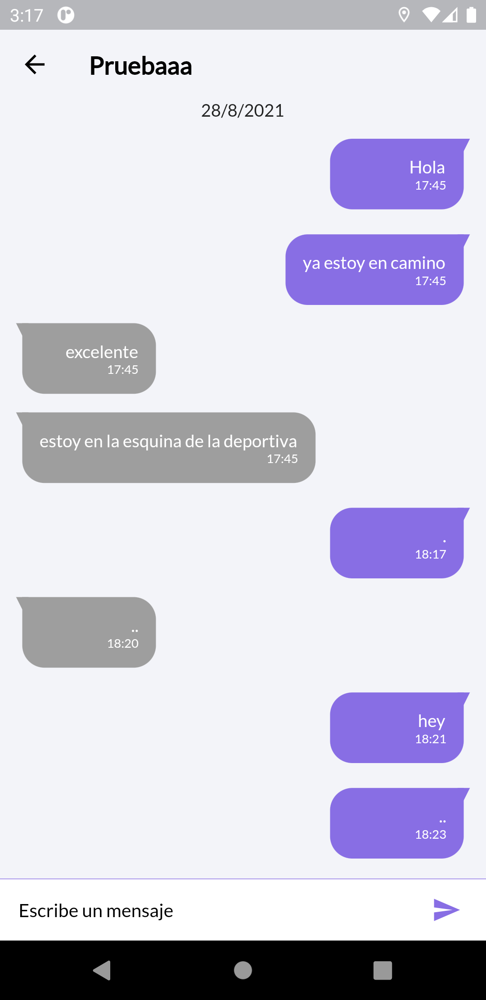
  

## :sparkles: Features ##

:heavy_check_mark: Chat;\
:heavy_check_mark: Push notifications;\
:heavy_check_mark: Ride history;\
:heavy_check_mark: User auth;\
:heavy_check_mark: Live ride requests;\
:construction: Deep links to follow other user's ride;\
:construction: Card payment;\
:construction: Web admin;\
:construction: Dynamic ride price;\

## :rocket: Technologies ##

The following tools were used in this project:

- [Flutter 2.2.3](https://flutter.dev/)
- [Provider](https://pub.dev/packages/provider)
- [Firebase Messaging](https://pub.dev/packages/firebase_messaging)
- [Firebase Auth](https://pub.dev/packages/firebase_auth)
- [Firebase Cloud Functions](https://firebase.google.com/docs/functions/)
- [Firebase Firestore](https://pub.dev/packages/cloud_firestore)
- [flutter_notification_channel](https://pub.dev/packages/flutter_notification_channel)
- [Node.js](https://nodejs.org/en/)
- [TypeScript](https://www.typescriptlang.org/)

## :memo: License ##

This project is under license from MIT. For more details, see the [LICENSE](LICENSE.md) file.

Made with :heart: by <a href="https://github.com/GonzaloAldana" target="_blank">Gonzalo Aldana</a>

&#xa0;

<a href="#top">Back to top</a>
